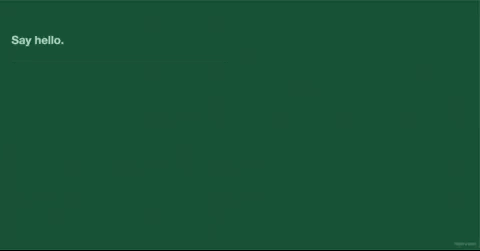
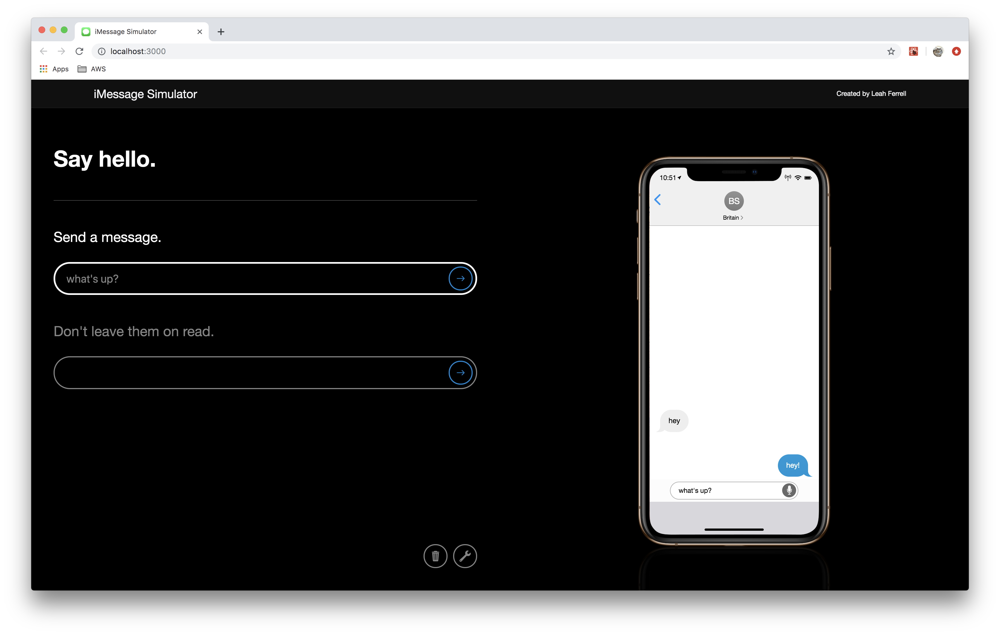

# imessage-react
iMessage simulator written in React.js

## About

This project was developed by Leah Ferrell as an exploration of React and Redux concepts.

## How to Run

1. Clone this repository to your local machine
2. `npm install`
3. `npm start`
4. Navigate to: `http://localhost:3000`

## Screen Shots

